# Zerodha Clone

A full-stack trading platform clone built with modern web technologies, featuring a responsive frontend, interactive dashboard, and robust backend API.

## 🏗️ Project Structure

This project consists of three main components:

- **Frontend**: Marketing website with responsive design
- **Dashboard**: Interactive trading dashboard with real-time charts
- **Backend**: RESTful API with authentication and data management

## ✨ Features

### Frontend (Marketing Site)
- 📱 **Responsive Design**: Mobile and desktop optimized
- 🎨 **Modern UX**: Clean and intuitive user interface
- 🚀 **Smooth Navigation**: Seamless page transitions
- 📄 **Complete Pages**: Home, About, Products, Pricing, Support
- 🔐 **Authentication**: Register, Login, Logout functionality
- 📱 **Mobile-First**: Optimized for all screen sizes

### Dashboard (Trading Interface)
- 📊 **Stock Watchlist**: Real-time stock monitoring with interactive charts
- 💹 **Trading**: Buy and sell stocks with live market data
- 📈 **Portfolio Management**: Track current holdings and positions
- 📋 **Order Management**: Place, view, and manage orders
- 💰 **Funds Management**: Monitor account balance and funds
- 📊 **Data Visualization**: Interactive charts using Chart.js
- 🎯 **User Dashboard**: Personalized trading overview

### Backend (API Server)
- 🔐 **Authentication**: Secure user registration and login with JWT tokens
- 👤 **User Management**: Complete user authentication system
- 📊 **Holdings API**: Get all user holdings from database
- 📈 **Positions API**: Retrieve all trading positions
- 📋 **Orders API**: Complete order management system
- ✅ **Input Validation**: Request validation using Zod
- 🔒 **Security**: Password hashing with bcryptjs
- 📡 **CORS Enabled**: Cross-origin resource sharing support

## 🛠️ Tech Stack

### Frontend
- **Framework**: React 19.1.1
- **Routing**: React Router DOM 7.8.0
- **Notifications**: React Toastify 11.0.5
- **Testing**: React Testing Library
- **Build Tool**: React Scripts

### Dashboard
- **Framework**: React 19.1.1
- **UI Library**: Material-UI (MUI) 7.2.0
- **Charts**: Chart.js 4.5.0 with React Chart.js 2
- **HTTP Client**: Axios 1.11.0
- **Icons**: MUI Icons Material
- **Styling**: Emotion (React & Styled)

### Backend
- **Runtime**: Node.js
- **Framework**: Express.js 5.1.0
- **Database**: MongoDB with Mongoose 8.17.0
- **Authentication**: Passport.js with Local Strategy
- **Security**: bcryptjs for password hashing
- **Validation**: Zod 4.0.15
- **Environment**: dotenv for configuration
- **Development**: Nodemon for hot reloading

## 🚀 Getting Started

### Prerequisites
- Node.js (v16 or higher)
- MongoDB database
- npm or yarn package manager

### Installation

1. **Clone the repository**
```bash
git clone <repository-url>
cd zerodha
```

2. **Install Frontend Dependencies**
```bash
cd frontend
npm install
```

3. **Install Dashboard Dependencies**
```bash
cd ../dashboard
npm install
```

4. **Install Backend Dependencies**
```bash
cd ../backend
npm install
```

5. **Environment Setup**
Create a `.env` file in the backend directory:
```env
MONGODB_URI=your_mongodb_connection_string
JWT_SECRET=your_jwt_secret_key
PORT=5000
```

### Running the Application

1. **Start the Backend Server**
```bash
cd backend
npm start
```

2. **Start the Frontend (Marketing Site)**
```bash
cd frontend
npm start
```

3. **Start the Dashboard**
```bash
cd dashboard
npm start
```

The applications will be available at:
- Frontend: http://localhost:3000
- Dashboard: http://localhost:3001
- Backend API: http://localhost:5000

## 📸 Screenshots

### Frontend Pages

#### Home Page
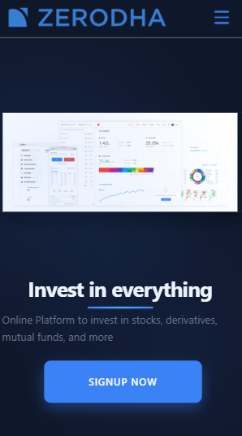
*Hero section with modern design and call-to-action*

#### About Us
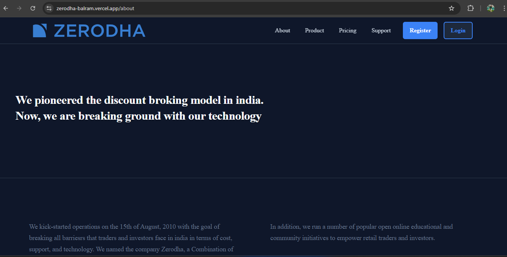
*Company information and mission statement*

#### Products & Services
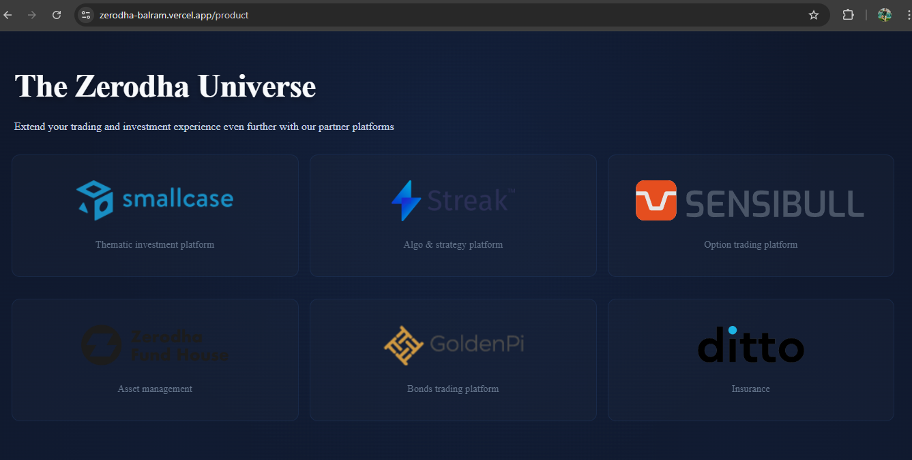
*Overview of trading products and services*

#### Pricing Plans
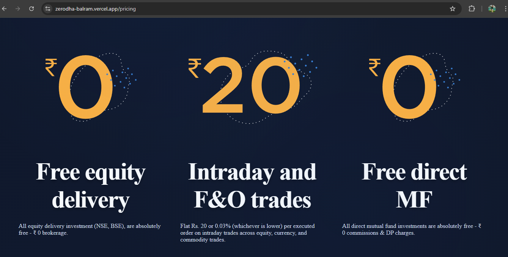
*Transparent pricing and feature comparison*

#### Customer Support
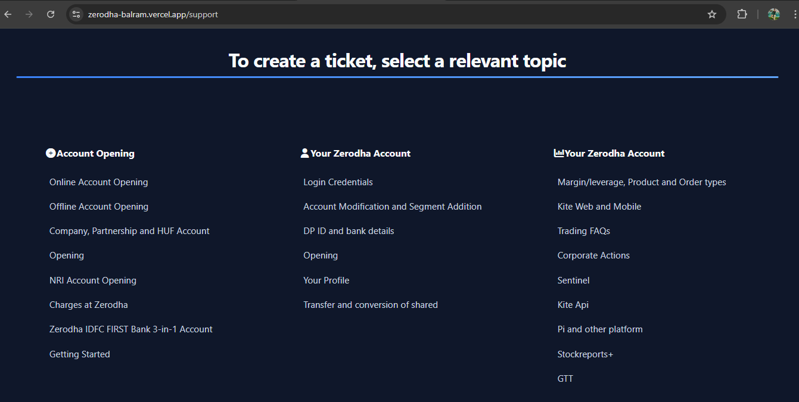
*Help center and customer service portal*

#### Authentication
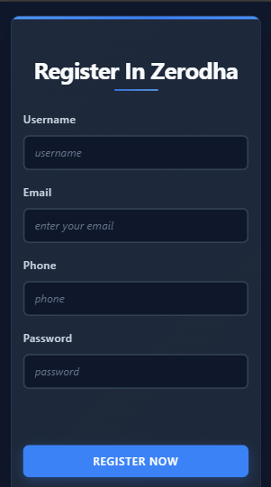
*User registration form*


*User login interface*

### Dashboard Views

#### Watchlist
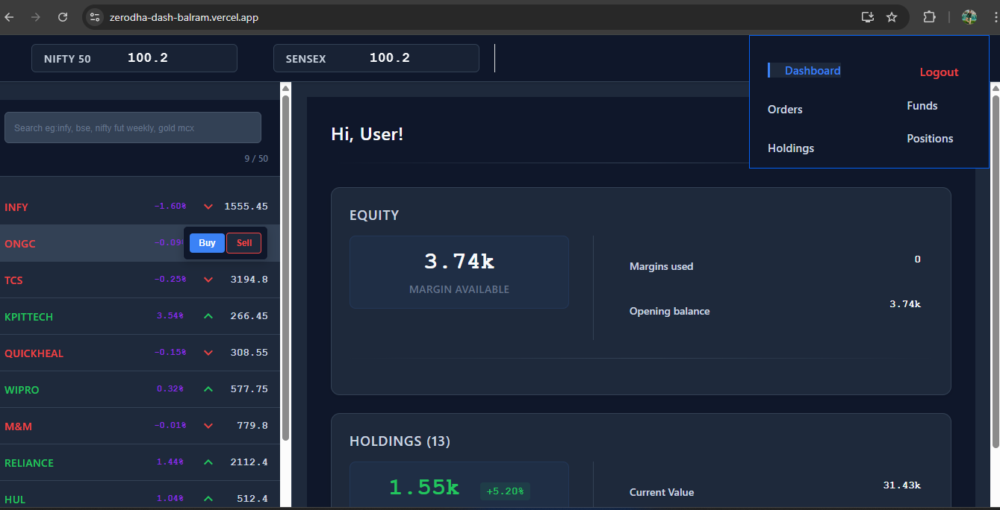
*Stock monitoring with real-time charts and market data*

#### Dashboard Overview
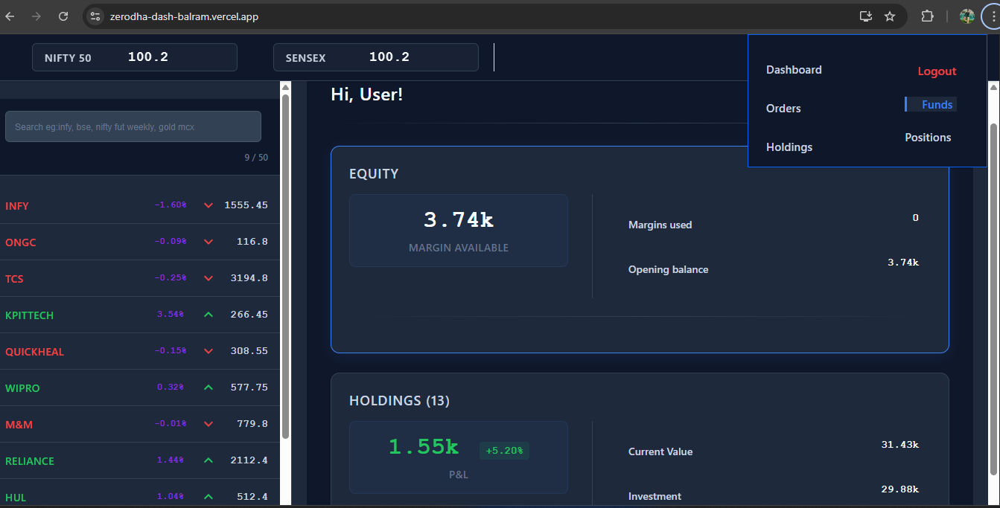
*Trading overview and portfolio summary with key metrics*

#### Buy Stock
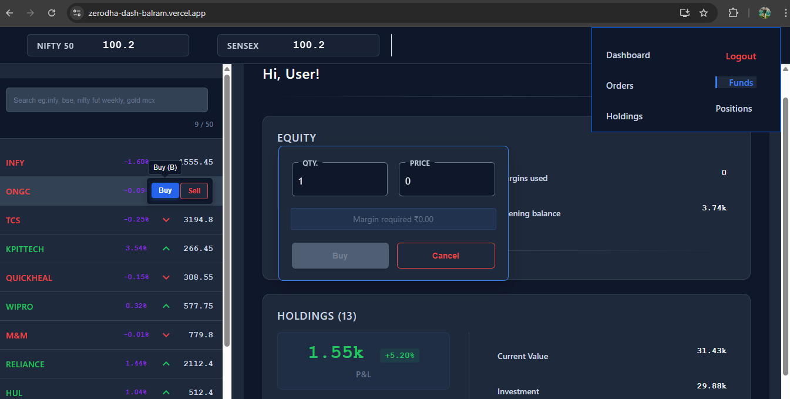
*Stock purchase interface with order placement*

#### Sell Stock
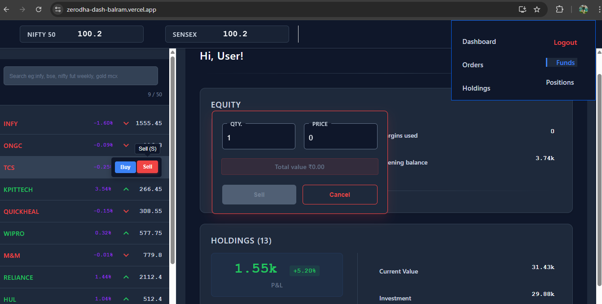
*Stock selling interface with position management*

#### Orders Management
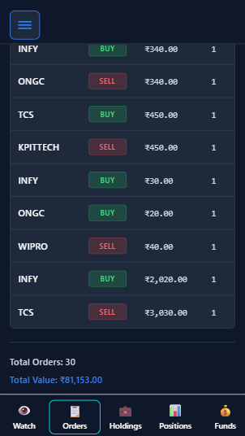
*Order history and active order management*

#### Holdings
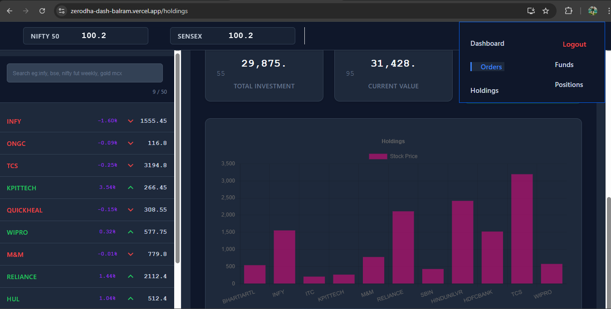
*Current stock positions and portfolio value*

#### Funds
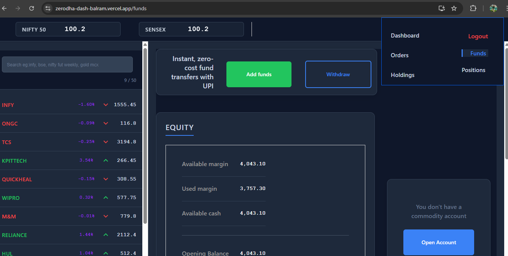
*Account balance and transaction history*

#### Positions
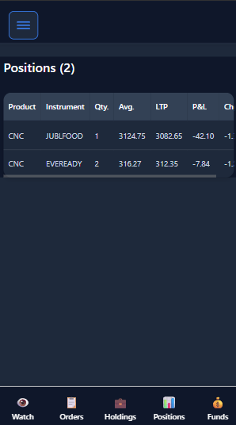
*Active trading positions with P&L tracking*

## 🔧 API Endpoints

### Authentication
- `POST /register` - User registration
- `POST /login` - User login
- `POST /logout` - User logout

### Trading Data
- `GET /holdings` - Get user holdings
- `GET /positions` - Get user positions
- `GET /orders` - Get user orders
- `POST /orders` - Place new order

## 🧪 Testing

Run tests for each component:

```bash
# Frontend tests
cd frontend && npm test

# Dashboard tests
cd dashboard && npm test
```

## 📦 Building for Production

```bash
# Build frontend
cd frontend && npm run build

# Build dashboard
cd dashboard && npm run build

# Start backend in production
cd backend && npm run prod
```

## 🤝 Contributing

1. Fork the repository
2. Create a feature branch (`git checkout -b feature/AmazingFeature`)
3. Commit your changes (`git commit -m 'Add some AmazingFeature'`)
4. Push to the branch (`git push origin feature/AmazingFeature`)
5. Open a Pull Request

## 📄 License

This project is licensed under the ISC License.

## 👨‍💻 Author

**Balram** - Full Stack Developer

## 🙏 Acknowledgments

- Zerodha for inspiration
- React community for excellent documentation
- Material-UI for beautiful components
- Chart.js for data visualization

---

**Note**: This is a clone project for educational purposes. Not affiliated with the actual Zerodha platform.